<!-- KMoula30 — GitHub Profile README -->


<p align="center">
  
</p>

<p align="center">
  <a href="https://www.mag-motor.com"></a>
  <a href="mailto:kmoulakis@mag-motor.com"></a>
  <a href="https://www.linkedin.com/in/kmoulakis"></a>
  
</p>

---

## 🧭 The Log Pose

```python
class KonstantinosMoulakis:
    def __init__(self):
        self.role        = "Humanoid Powertrain Lead @ TII"
        self.crew        = "Straw Hat Engineers"
        self.previous    = ["Sr. EM Engineer @ Tesla", "EM Engineer @ Tesla", "Assoc. Design Eng @ Tesla"]
        self.domains     = ["E-Motors", "Inverters", "Drive Units", "Humanoid Actuators", "Battery Packs"]
        self.tools       = ["Python", "FEMM", "ANSYS", "MATLAB", "C++", "FEA", "Multiphysics"]
        self.dream       = "Build the drive system that conquers the Grand Line"
        self.website     = "www.mag-motor.com"
```

- 🤖 Currently designing the **powertrain of a humanoid robot** @ Technology Innovation Institute
- 🧲 Former **Tesla EM Engineer** — EM motor design, iron loss modeling, e-steel R&amp;D &amp; qualification
- ⚡ Bridging physics-based simulation and production hardware every day
- 🍖 Powered by physics, math, and an unreasonable amount of meat

---

## ⚙️ Devil Fruit Powers

<p align="center">
  
  
  
  
  
</p>
<p align="center">
  
  
  
  
  
</p>

---

## 🗺️ Grand Line Stats

<p align="center">
  
</p>

<p align="center">
  
  
</p>

---

<p align="center">
  <i>"I don't want to conquer the seas. I just want to build the most efficient powertrain on the Grand Line." ⚡🏴‍☠️</i>
</p>


